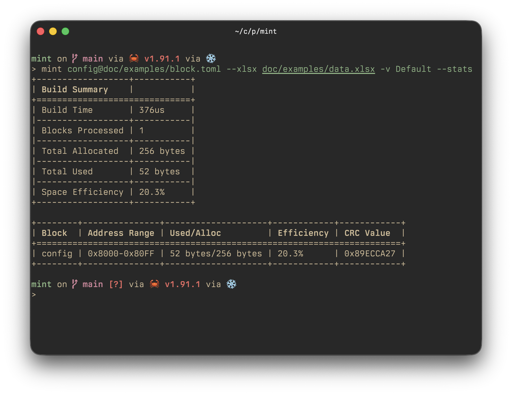

## mint

Build flash blocks from a layout file (TOML) and a data source (Excel or JSON), then emit hex files.



Install with `cargo install mint-cli` or via nix flakes.

### Documentation

- [CLI reference](doc/cli.md)
- [Layout files](doc/layout.md)
- [Data sources](doc/sources.md)
- Examples

### Quick Start

```bash
# Excel data source
mint block.toml --xlsx data.xlsx -v Default --stats

# JSON data source
mint layout.toml --json data.json -v Debug/Default

# Multiple blocks with options
mint layout.toml#config layout.toml#calibration --xlsx data.xlsx -v Production/Default --stats
```

### Layout Example

```toml
[config.data]
device.info.version.major = { name = "FWVersionMajor", type = "u16" }
device.info.name = { name = "DeviceName", type = "u8", size = 16 }
calibration.coefficients = { name = "Coefficients1D", type = "f32", size = 8 }
calibration.matrix = { name = "CalibrationMatrix", type = "i16", size = [3, 3] }
message = { value = "Hello", type = "u8", size = 16 }
```

See examples for full layouts and sample data.
